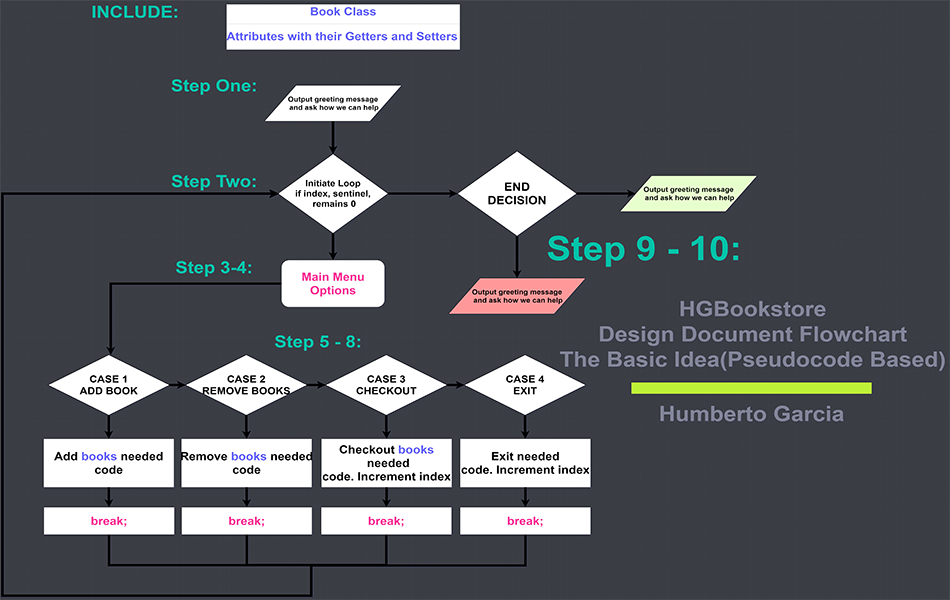
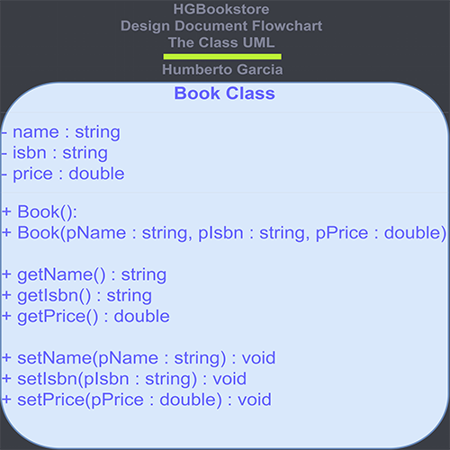

# :books: HGBookstore


## Description

#### Summary
The HGBookstore is meant to be a friendly user-interactive program that simulates a store setting with different printed menu options from start to end. Using Visual Studio 2019, this project was made to deepen my knowledge of fundamental C++ programming logic utilizing the STL Library and object oriented programming.

#### ‎Demonstration
 - Buying books process execution:


 - Not buying books process execution:


## Installation

#### Build Releases
 - Current release: [HGBookstore v1.0.0](https://github.com/HumbertoGarciaJr/HGBookstore-GarciaHumberto/releases/tag/v1.0.0)
 - Other releases: [Older Versions](https://github.com/HumbertoGarciaJr/HGBookstore-GarciaHumberto/releases)

#### Create Repository Locally

1. **Copy** the repository using the web URL.

```bash
https://github.com/HumbertoGarciaJr/HGBookstore-GarciaHumberto.git
```

2. Open **Git Bash** terminal.

3. Change the directory to the location you want the repository to be in.

4. Type the command `git clone`, and **Paste** the web url copied earlier.

```bash
git clone https://github.com/HumbertoGarciaJr/HGBookstore-GarciaHumberto.git
```

5. Press **Enter**, and the repository should be successfully cloned and created with local access to it.

## Development Screenshots/Examples

**Design flowchart of each step process in the store.**



**Example code snippet implementation of printed main menu options and switch case a, adding books.**

```c++
//While Loop
while (index == 0)
{
	//Print options
	cout << "\t\t***********MAIN MENU***********\n"
		"----------------------------------------------------------------\n"
		"(Press Option a, b, c, d):\n"
		"a. Add book to shopping cart\n"
		"b. Remove all books from shopping cart\n"
		"c. Checkout\n"
		"d. Exit\n"
		"----------------------------------------------------------------" << endl;

	//Read User & Store
	cin >> customerChoice;

	//Switch Case
	switch (customerChoice)
	{
	case ('a'):
	case ('A'):
		//Print
		cout << "\t\t***********BOOK CATALOG***********\n"
			"\"Press any of number 1-5 to add specific book to checkout cart\":\n"
			"----------------------------------------------------------------" << endl;
```

**Example code snippet implementation statements to control different outcomes based on if user is buying books.**

```c++
//If/Else Statement
if (isBuyingBooks == false)//User isn't buying books
{
	//Print sorry letting customer go without purchasing a single item
	cout << "****************************************************************************\n"
		"\t\"We're sorry to see you go like that... \n"
		"   \"We hope you reconsider our store in the future.\"" << endl;
}
else if (isBuyingBooks == true)//User is buying books
{
	//Print thank you for buying any amount of books
	cout << "\t\"Thank you for shopping with us, we hope to see you soon!!!\"\n" << endl;
}
```

**Design class diagram of a book encapsulated with attributes and data.**



**Example code snippet specification of book header file attributes and constructor.**

```c++
private:
	//Attributes
	string name, isbn;
	double price;

public:
	//Constructor no argument default
	Book()
	{
		name = "None";
		isbn = "None";
		price = 0.0;
	}

	//Constructor 3 argument
	Book(string pName, string pIsbn, double pPrice);
```

**Example code snippet implementation of book class file constructor body modification.**

```c++
//Body/Modify Book class at the scope of Book Constructor 3 argument
Book::Book(string pName, string pIsbn, double pPrice)
{
	name = pName;
	isbn = pIsbn;
	price = pPrice;
}
```

## Authors

- [@HumbertoGarciaJr](https://github.com/HumbertoGarciaJr)
